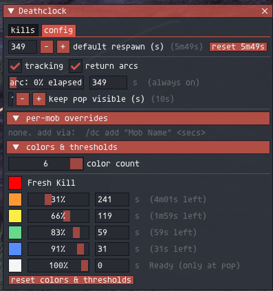
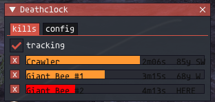
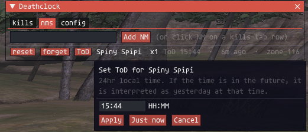
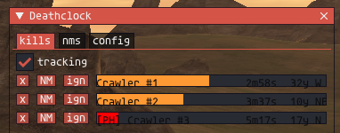
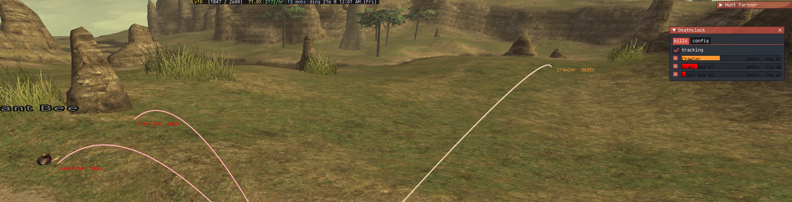

# deathclock

An [Ashita v4](https://www.ashitaxi.com/) addon for FFXI that tells you, at a glance, **when each mob you killed is about to repop and where its corpse landed**.

Extracted from [huntpartner](https://github.com/TreeFidyDad/huntpartner) v0.7.93 so respawn tracking can be reloaded independently of the rest of huntpartner's surface area.

> ⚠️ Respawn windows and entity behavior differ between servers — YMMV. Tune the defaults for your environment.

---

## What it does

- **Tracks mob deaths** via HPP-scan — no packet hooks, no chat scrape. It watches the entity table for HP `0` with a previous non-zero, on mob entities only.
- **Only your kills** — by default, only mobs claimed by you or your party/alliance at time of death are tracked. Random mobs killed by passers-by don't get added to the list. Toggle in the config tab or with `/dc mine`.
- **Predicts respawn** using a configurable default window (349s — based on observed claim-mob respawns; tune for your server) and per-name overrides.
- **Color-tiered ETA bars** — fully configurable. By default: 6 bands from "Fresh Kill" red through orange / yellow / green / cyan / white at pop.
- **NMs tab** — auto-detects Notorious Monster kills from the death chat (FFXI omits the "The " article for NMs) and keeps a persistent kill counter with ToD per mob. Once flagged, NMs are excluded from the respawn list (window/lottery spawns don't fit a fixed timer model).
- **Placeholder learning** — records the server-side spawn slot (server_id) of every kill, so once the addon has seen the same slot host both an NM and a non-NM, it knows that non-NM is the NM's placeholder. PH kills then get a `[PH]` tag on the kills tab, a chat callout (`[PH for Spiny Spipi]`), and tooltip naming the NM. Use `/dc target` to inspect a live target's slot history *before* you swing.
- **3D return-arcs** drawn in-world from your character to each death spot, colored by the same 5-band palette so a glance at the screen tells you what's about to pop (vendored from [`targetlines`](https://github.com/RolandJ/targetlines)).
- **Floating mob labels** that ride the apex of each return-arc so you can identify which line goes to which corpse — even when you've kited halfway across the zone.
- **"Keep pop visible"** window — kills stay in the list for N seconds after they pop so you have time to actually look at them.
- **Session-only ignore set** — mute noise mobs (`/dc ignore Svana Rarab`) without persisting the choice across reloads.

---

## Screenshots

### Config tab

Default respawn, tracking + arc toggles, per-mob overrides, and a fully editable color/threshold table.



### Kills tab

Live mob list with ETA bars, direction + yalms to corpse, single-click clear.



### NMs tab

Auto-populated kill counter for Notorious Monsters with ToD timestamp. Right-click a row to reset the counter or un-flag the mob.



### Placeholder learning

Same kills tab, but now slot `0x01074130` has been observed hosting Spiny Spipi — so the third Crawler row (the one at that slot) is tagged `[PH]`. Hover for the NM name; identical-name mobs at *other* slots stay untagged.



### Return arcs + labels in-world

Arcs colored by remaining time, labeled at the apex with mob name + ETA.



---

## Install

1. Drop the `deathclock/` folder into `Ashita\addons\`.
2. In game: `/addon load deathclock`.
3. `/dc` to toggle the window. `/dc help` is not a thing — see commands below.

deathclock is **fully standalone**. Its 3D-line machinery (`drawArc`, world-to-screen projection) is vendored under `vendor/targetlines/` — see `vendor/targetlines/NOTICE.md` for attribution.

---

## Commands

```
/dc                          toggle window
/dc show | hide
/dc list                     print pending kills + ETAs to chat
/dc clear [Name]             clear all, or just this mob
/dc add "Mob Name" <secs>    per-mob respawn override
/dc default <secs>           change global default respawn
/dc ignore [Name]            mute this mob for the session
/dc unignore [Name]          unmute (or clear all)
/dc lines                    toggle 3D return-arcs
/dc mine                     toggle "only my kills" filter
/dc all                      toggle "always show arcs" (bypass elapsed-pct threshold)
/dc nm list                  print tracked NMs + counts to chat
/dc nm add <Name>            manually flag a mob as NM (sweeps it from kills tab)
/dc nm reset <Name|all>      reset kill counter for one NM, or all
/dc nm forget <Name>         un-flag a mob as NM (so it goes back to the respawn list)
/dc target                   inspect current target: name, server_id, slot history (NM/PH evidence)
/dc slots                    summary of slots with PH evidence (slot has hosted both an NM and a non-NM)
/dc slots verbose            full dump of every slot observed + per-name kill counts
/dc slots tag <id> <Name>    manually seed a slot/NM pair (accepts decimal or 0xHEX server_id)
/dc slots clear              wipe slot_map (start placeholder learning over)
/dc mobdb                    toggle mobdb integration (auto-detect Notorious via its data files)
/dc test                     drop a TestMob entry to verify rendering
/dc diag                     dump last label-render error (if any)
/rt <subcmd>                 short alias for /dc <subcmd>
```

---

## Configuration

Everything below is editable from the **config** tab — no need to hand-edit XML:

| Setting | What it does |
|---|---|
| `tracking` | Master on/off for kill tracking |
| `only my kills` | When on, skip mobs claimed by others. Uses `GetClaimStatus` low 16 bits vs. party/alliance server IDs at the frame before death |
| `return arcs` | Master on/off for 3D arcs |
| `arc: X% elapsed` | Don't draw arcs until X% of the respawn window has elapsed. `0` + "always on" = always draw |
| `keep pop visible (s)` | How long popped (Ready) mobs stay in the list before auto-clearing |
| `default respawn (s)` | Global default if no per-mob override exists |
| `use mobdb` | When mobdb is installed, read its zone data files to detect Notorious mobs and auto-route them to the NMs tab on first kill. Respawn timers stay HorizonXI-tuned (349s default), since mobdb data is retail/AirSkyBoat-era |
| `bg opacity` | Window background transparency (0.0 = fully transparent, 1.0 = opaque) |
| `per-mob overrides` | Named exceptions to the default |
| `colors & thresholds` | Number of color bands + the percent-elapsed boundary + display color for each |

---

## First-load migration

If you previously ran the respawn feature inside `huntpartner` and have `addons/huntpartner/settings/settings.xml` on disk, deathclock will lift over `default_respawn`, `keep_dead_after_respawn`, `track_respawns`, `respawn_lines`, `respawn_lines_show_all`, and per-mob `overrides` on first load. Best-effort; sets a one-shot sentinel so it doesn't retry.

---

## Why a separate addon

huntpartner reloads frequently during development. A single Lua error in any of its features unloads the entire addon — taking respawn tracking down with it, mid-pull. Deathclock isolates the respawn surface so unrelated huntpartner work can't wipe your in-flight kill timers.

---

## Credits

- Extracted from [huntpartner](https://github.com/TreeFidyDad/huntpartner) v0.7.93.
- `vendor/targetlines/` (the `drawArc` machinery and `worldToScreen` helper) is vendored from the [`targetlines`](https://github.com/RolandJ/targetlines) addon — see `vendor/targetlines/NOTICE.md` for full attribution.
- Built with [Claude](https://claude.ai) (as Watney) as a coding partner.

---

## License

**GPL-3.0-or-later.** See [LICENSE](LICENSE).
